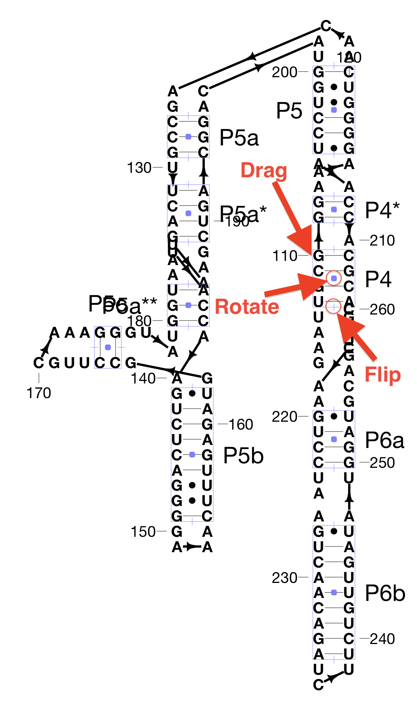
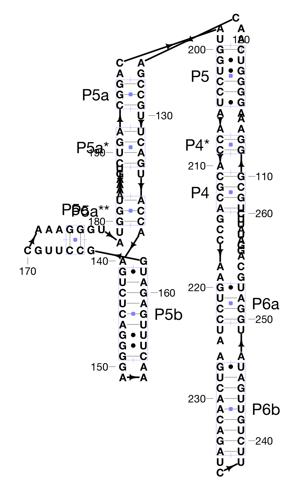
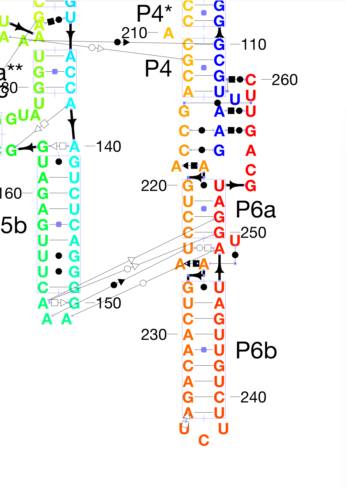
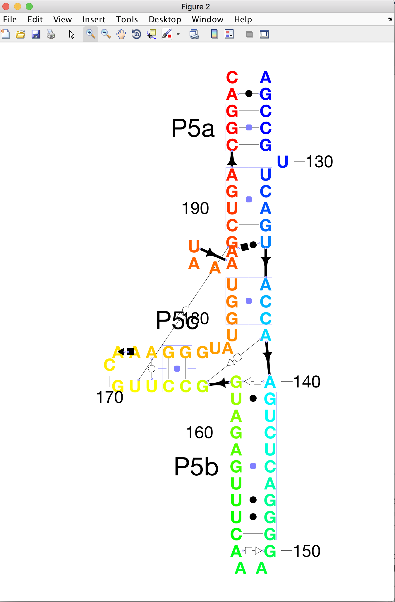
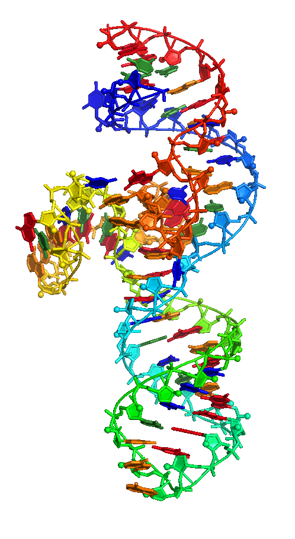
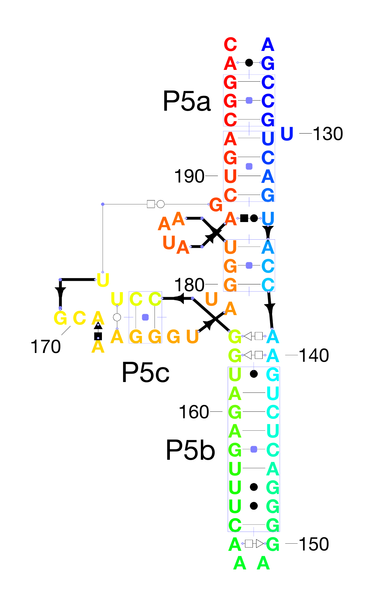
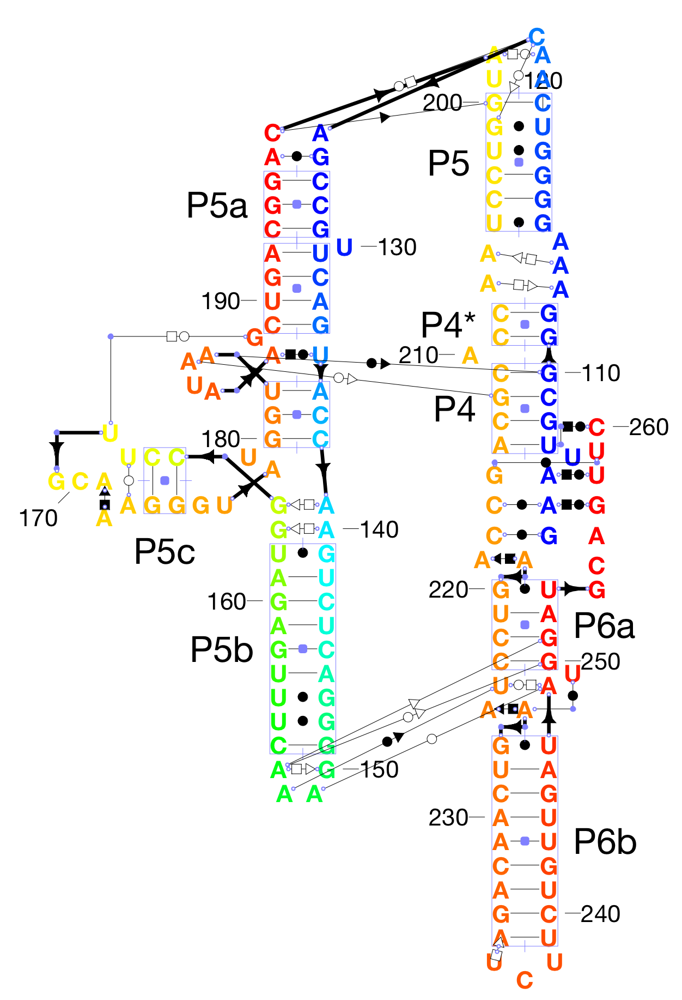
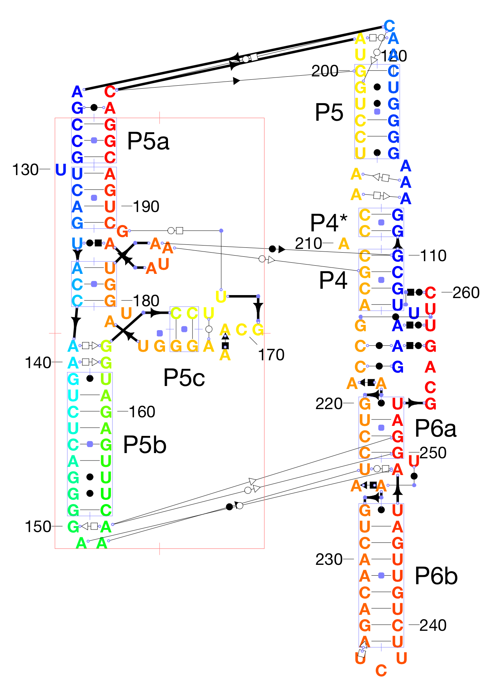
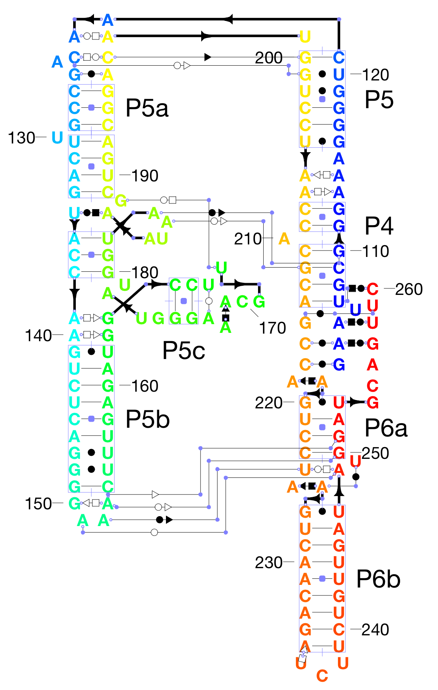

# RiboDraw Tutorial
Layout of the P4-P6 tertiary structure, showing noncanonical pairs  
_(C) Rhiju Das, Stanford University, 2018-2019_

Please e-mail questions to `ribokit.info@gmail.com`


## Goal

This tutorial aims to show you how to use the RiboDraw code to make a nice layout of the P4-P6 domain of the *Tetrahymena* group I self-splicing intron, based on the classic crystal structure  by Cate et al., [1GID](https://www.rcsb.org/structure/1gid). By the end of this tutorial, you'll know how to make this picture:


And along with it you'll have a Pymol Session with the 3D structure colored in an analogous way:


If you just want to skip ahead and check out an example of the final result, there are example output files in [example_output/](example_output) you can load in the drawing in MATLAB with:

```
load_drawing('example_output/1gidA_drawing.mat');
```

You can also try to follow the commands in [P4P6\_drawing\_commands.m](P4P6_drawing_commands.m), but they are better explained below. If you get stuck at particular steps, you can also load in intermediate drawings with the `load_drawing` command and the drawing workspaces saved in [example_output/workspaces/](example_output/workspaces)

## Before you start the tutorial
First, check out the [getting started](../README.md) page for RiboDraw & Rosetta installation instructions.

You might want to sketch out a drawing of your RNA 3D structure. For this tutorial, we're choosing to make the P4-P6 RNA, for which numerous representations are already floating around the literature (or passed around labs), though most leave out noncanonical pairs. Here's a picture of one 'legacy' diagram that was passed to me by Rick Russell, with some handwritten annotations:


Note that the P5abc section (left-hand side of this legacy ) is flipped horizontally compared to the final drawing at the top of this document -- one of the nice things about RiboDraw is that such flipping is pretty straightforward to do at any stage, and this tutorial will illustrate that action.

## Let's do this

### Step 0. Initialize the drawing

You'll first need to download the 3D structure from the PDB, cut out the bits you want to look at, and run the `rna_motif` Rosetta application. See [README.md](../README.md) for Rosetta instructions.  [If you don't have a 3D structure and don't care about noncanonical pairs, etc., you can get away with just having you sequence in a `.fasta` file and your stems defined in a `stems.txt` file; for examples of such a 'minimal' starting point, see [drawings/ribozymes/tC19Z/](https://github.com/ribokit/RiboDraw/tree/master/drawings/ribozymes/tC19Z). If you only have sequence and secondary structure, check out `initialize_files(sequence, secstruct, resnum, tag)`]

I've already done the Rosetta `rna_motif` stuff in [1gid_RNAA.pdb](1gid_RNAA.pdb). This is chain A from the PDB entry [1GID](https://www.rcsb.org/structure/1gid). I think I used `make_rna_rosetta_ready.py` and `extract_chain.py` in Rosetta's `rna_tools`, but you can also just prepare a similar file by hand.

Put this file into a new directory called `rna_motif`, and go into that directory:

```bash
mkdir rna_motif
cp 1gid_RNAA.pdb rna_motif
cd rna_motif
```

Now run on the UNIX command line:

```bash
rna_motif -s 1gid_RNAA.pdb -ignore_zero_occupancy false
```

You may need to use the full executable name (something like `rna_motif.macosclangrelease`) depending on how you've compiled Rosetta. The `-ignore_zero_occupancy false` flag tells Rosetta to go ahead and include a couple uridines that were uncertain in the experimental map and flagged as such by having their occupancies set to 0 in the PDB coordinate file.

The output should be a bunch of files:
```
1gid_RNAA.pdb.base_pairs.txt
1gid_RNAA.pdb.fasta
1gid_RNAA.pdb.ligands.txt
1gid_RNAA.pdb.motifs.txt
1gid_RNAA.pdb.other_contacts.txt
1gid_RNAA.pdb.stacks.txt
1gid_RNAA.pdb.stems.txt
```

These have the relevant information for RiboDraw. (Examples of these files are inside this tutorial directory `example_output/rna_motif/`[example_output/rna_motif/])

Last, you should probably define names of your helices. Open up `1gid_RNAA.pdb.stems.txt` in your favorite text editor. It should look like this:
```
A:107-110 A:211-214
A:111-112 A:208-209
A:116-121 A:200-205
A:127-129 A:193-195
A:131-134 A:189-192
A:136-138 A:180-182
A:141-149 A:154-162
A:165-166 A:174-175
A:220-223 A:250-253
A:227-235 A:239-247
```

You'll want to then add in labels for the helix/stem names that are conventional for researchers studying the molecule. In the case of P4-P6, I used:
```
A:107-110 A:211-214 P4
A:111-112 A:208-209 P4*
A:116-121 A:200-205 P5
A:127-129 A:193-195 P5a
A:131-134 A:189-192 P5a*
A:136-138 A:180-182 P5a**
A:141-149 A:154-162 P5b
A:165-166 A:174-175 P5c
A:220-223 A:250-253 P6a
A:227-235 A:239-247 P6b
```

A note here: By convention the entire stretch of 107-112 and 208-214, which is interrupted by a bulge at A210 is usually called P4. Rosetta and RiboDraw go ahead and split these into two helices. We'll call the second helical segment `P4*` for now, and hide this label later. Ditto for P5a.

(If you forgot to do this step and/or need to change the names later, edit the file as above, and run `update_helix_names('1gid_RNAA.pdb.stems.txt')`.)

Now, go into MATLAB and get into this `tutorial` directory. Type:

```Matlab
initialize_drawing( 'rna_motif/1gid_RNAA.pdb' );
```

Your MATLAB figure window should look like this:


Its a little crazy but all the information needed for the drawing is in there -- now we just need to lay it out.

### Step 1. Roughly lay out the helix stems
First step in layout: let's move/rotate the helix stems roughly where you want them. 

Helices are the fundamental objects in RiboDraw. The helces must be aligned either vertically or horizontally – a convention in the literature for depicting tertiary-folded RNAs in 2D that also nicely matches the fact that most helices in such an RNA really hve parallel or perpendicular axes. 
Let's hide the noncanonical pairs for now, which are distractions:

```Matlab
hide_noncanonical_pairs
```

Then make sure to show the control features that will let us manipulate helices (and any non-helical residues that are assoiated with them):

```Matlab
show_helix_controls
```
Note that these control features will not get output in the final image. (And you can hide them at any time with `hide_helix_controls`)

You'll see light blue rectangle outlines around each helix. You can  drag the rectangle outlines the boxes to move the helices. Try it! You'll see that non-helical residues are associated with nearby helices and move with them; you can drag them separately.

To rotate a helix, you can click on the little rounded square in the middle of each rectangle. (One such square control is marked with a red arrow labeled "rotate" on the image below.) Try it! 

Moving and zooming around in MATLAB can be a pain; the magnifying glass and hand tools in the menubar are available, but sometimes you'll get stuck. If you ever want to return to a view that encapsulates the whole drawing, type this:
```Matlab
set_artboards
```

Try to make your MATLAB figure window look like this:




### Step 2. Flipping helices
You can also now get the helices flipped so that there are fewer crossing between the arrow lines that connect residues.

To flip a helix horizontally or vertically, there are four tiny dashes cutting through the outer edges of the rectangles (see also the red arrow marked "flip" in the image above). 

Try to make the helices look like this


Now might also be a good time to save our work. All the information in the drawing can be output with
```Matlab
save_drawing( 'drawing.mat' );
```
And can be read back in later with

```Matlab
load_drawing( 'drawing.mat' );
```

### Step 3. Refine arrow linkers and noncanonical pairs
Now let's refine things a bit. 

We'll move some of the arrows so that instead of shooting off at weird angles they have joints that primarily go horizontal and vertical. 

Let's turn on control features that will let us adjust linkers:
```Matlab
show_linker_controls
```
Little circles show up at the ends of each arrow. We can add joints to linkers by pulling on little circles at residues. We can also remove unwanted joints by moving little circles back on to residues. Try it out.

This is also a good time to display noncanonical pairs, which also involve lines that we can add joints to and refine:

```Matlab
show_noncanonical_pairs
```

As we do this refinement of the 2D drawing, we'd like to preserve some elements of the 3D arrangement of the nucleotides. How to do this is subjective, but it helps to have a reference 3D structure open in Pymol side-by-side. Let's also color nucleotides in 'rainbow' coloring in both Pymol and RiboDraw (MATLAB) to make it easy to see correspondences. 

Start up Pymol, load in the secondary structure, and setup up 5'-to-3' rainbow coloring:
```bash
load 1gid_RNAA.pdb
show cartoon
rr()   # this is if you have RiboVis loaded. Otherwise color->spectrum->rainbow
```

 Try to zoom in on the P6a-P6b region (where the red and blue strands intertwine). Should look like this:


Back in RiboDraw (MATLAB), you can get matching rainbow 5'-to-3' coloring with the command
```Matlab
color_drawing rainbow
```

Note that you'll be able to restore coloring to black -- or any other coloring scheme -- later on.

Let's zoom into the P6a-P6b region (use the magnifying glass tool in the menubar of the Matlab figure window).

Now try to move the nucleotides, linkers, and helices around P6a and P6b (which bracket the so-called tetraloop receptor) to look like this:



*Tip:* As we move helices, associated residues move with them. If you don't like how a non-helical residue is assigned to a "parent" helix, you can actually drag that residue into another helix, and that will change its assignment.

*Note:* Noncanonical pairs for last two residues (U259, C260) look misassigned by rna\_motif because of the heuristic that Rosetta uses to classify pairs; could be fixed in the future, but generally these issues only occur in parts of the structure with poorly resolved pairs. **

### Step 4. Slicing out sections to focus.
OK, in principle, now you're good to go -- just keep refining. But there are some useful extra tricks worth knowing.

For RNAs that contain subdomains, it can often be easier to refine the RiboDraw layouts if we just focus on those subdomains. Its also often nice to have those 'subdrawings' on hand. Last, for large RNAs (like the ribosome), RiboDraw can get slow due to MATLAB's poor handling of numerous graphical elements. Then it actually becomes critical to slice out subdomains to maintain real-time interactivity as we lay out the drawing.

In this step, you'll learn how to slice and merge a subdomain of P4-P6 called P5abc.

#### Step 4A. Slice out P5abc
Let's zoom back out (double click with magnifying glass icon, or type `set_artboards`).

Then, let's slice out the P5abc subdomain
```Matlab
 slice_drawing( 'A:127-195' )
```
It will show up in a new Figure 2 window that we can edit, just like the original drawing (which stays in the original Figure 1 window).

You might get a warning like: `Warning! slice_res only catches part of helix Helix_A127...` but that's just to tell you that a few stray residues are also going to be transferred to this sliced drawing (which will simplify merging later on).

Since this subdrawing all looks kind of the same color, recolor by rainbow so that the residues have really contrasting colors, and zoom in: 

```Matlab
color_drawing rainbow
set_artboards
```

You can also get rid of those distracting extra helix labels:

```
hide_helix_label( 'P5a*' );
hide_helix_label( 'P5a**' );
```

Your subdrawing RiboDraw window should look like this:



Over in PyMol, you can also recolor the molecule to allow side-by-side comparison of P5abc in 3D with your 2D drawing in RiboDraw. In PyMol:

```Pymol
color white
rrs( 'chain A and resi 127-195')
hide ev, not (chain A and resi 127-195)
```




#### Step 4B. Refine P5abc layout

Now again edit the linkers, helices, and nucleotides until they look good to you – mostly horizontal and vertical lines, and with nucleotides similar to their arrangement in 3D:



If you want you can save this subdrawing:

```Matlab
save_drawing( 'subdrawing_P5abc.mat' );
```

#### Step 4C. Re-install the subdomain into the global drawing
You can now move your nice P5abc drawing back into the full drawing of the P4-P6 RNA:

```Matlab
merge_drawing();
set_artboards
```

The information on what the parent drawing for the subdrawing was (Figure 1) was stored when it was sliced out. But if you want to be careful you can also specify which parent drawing to merge into, by specifying its figure number (1, in this case): `merge_drawing(1);`



### Step 5. Flipping a multi-helix domain

In old drawings, P5abc is often drawn so that P5c juts out to the left; but given the known 3D structure of P4-P6, it probably should be drawn pointing to the right, *towards* the other helices in the molecules rather than away.

RiboDraw provides a nice way to select domains and flip them. Here's how to do it with P5abc. First, let's select P5abc as a domain object

```Matlab
setup_domain(  'A:127-195','P5abc' )
list_domains
hide_domain_label( 'P5abc' )
```

Then, we can get rotation/dragging/flipping controls for this domain -- totally analogous to the controls for helices -- with:
```Matlab
show_domain_controls
```


Now click on the flip (the thin red dashed line going through the red rectangle):



### Step 6. Refine!

Let's refine the rest of the drawing. Restore rainbow coloring in RiboDraw:

```Matlab
color_drawing rainbow
```
and in Pymol:

```Pymol
rrs()
```

Remove some extraneous labels and controls:

```Matlab
hide_helix_label( 'P4*')
hide_domain_controls
```

And strive for a layout that looks like this:



### Step 7.  Color as you like it
Typically for these 2D layouts it's best to not have rainbow coloring in the final image – too many colors. It's more conventional to have the structures colored by helices or stacks of helices. Here's how you can do that.

Get rid of some of the control features so that it's easier to see the final result.

```
hide_linker_controls
hide_helix_controls
```

Then it's a matter of setting up domains, and choosing colors. Conveniently, all the colors available in Pymol ("salmon", "teal", "marine", etc.) can be used in RiboDraw, as well as RGB values, as described in the [color_drawing](..//scripts/color/color_drawing.m) documentation.

Start by making the whole thing gray:

```Matlab
color_drawing gray
```

Expand the definition of P5abc to include all the nucleotides that are on the left hand side of the drawing, and let's color them marine:

```Matlab
setup_domain(  'A:122-198','P5abc' ); color_drawing marine P5abc 
```

Similar for the other domains – let's color them purple and forest:

```
setup_domain(  'A:107-121 A:199-214','P4P5' );
color_drawing purple P4P5 
setup_domain(  'A:220-253','P6' ); 
color_drawing forest P6 
```

You probably don't need the domain labels:
```
hide_domain_label( 'P5abc' );
hide_domain_label( 'P4P5' );
hide_domain_label( 'P6' );
```

Now let's save the drawing:
```
save_drawing( '1gidA_drawing.mat' );
export_drawing( '1gidA_drawing.png' );
```

*Tip:* You can also export to PDF, PS and (maybe) SVG by changing the extension. Check out documentation for [export_drawing](..//scripts/drawing/export_drawing.m).

Here's my final `.png` result, after a few more tweaks:
 
 


Let's also prepare our 3D view of the molecule with the same coloring. In Pymol:

```Pymol
color gray
select P5abc, resi 122-198
select P4P5, resi 107-121 or resi 199-214
select P6, resi 220-253
color marine, P5abc
color purple, P4P5
color forest, P6
hide spheres
```

Save the Pymol session for future use, and also make an image in 3D
```
save 1gid_RNAA.pse
ray 600,800
save 1gidA_pymol.png
```


### Step 8.  Other color schemes

What if you have experimental data you want to visualize on your secondary structure? 

For example, papers that discover new conserved ncRNA elements follow a certain visual language to convey sequence conservation: nucleotides may be red or gray to indicate sequence frequnecy, or replaced wholesale by colored circles if deletions are possible.

Structural studies that use chemical reagents to support or invalidate a hypothesized secondary structure may wish to visualize relative reactivity to chemical reagents. RiboDraw makes both easy.

Initialize a drawing from sequence and secondary structure, such as the [COVID19 frameshift element](chemical_mapping/COVID19_FSE_tutorial.m). Arrange the helices as you prefer. You can bold all 100% conserved residues with:

```
set_boldface(1, get_res_tags( 'A:13459-13487 A:13489-13509 A:13511-13516 A:13518-13520 A:13522-13532 A:13534-13535 A:13537-13547' ) )
```

or set their font color via `set_fontcolor`, which is an alternative to `color_drawing` that takes a set of residue tags directly, rather than a predefined domain.


Coloring by reactivity is straightforward as well, but you use a command like:

```
color_rings_by_float_data('A:13459-13547', SHAPE_normalized);
```

where `SHAPE_normalized` is a 1D array of normalized reactivity data. The result will be colored from white to yellow to red.


